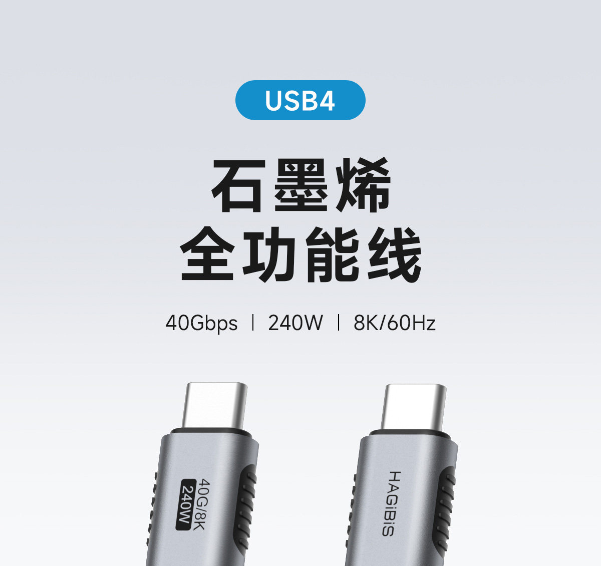

在我日常上b站冲浪的时候，刷到了一条视频《[49 元还不错！体验拆解大疆 240W 数显线\_哔哩哔哩\_bilibili](https://www.bilibili.com/video/BV1dKpw6xEiE/ "49 元还不错！体验拆解大疆 240W 数显线\_哔哩哔哩\_bilibili")》，在我认知中数显线不都得三位数起跳吗，更何况都是大疆出品，还是240W，看了下网友评论和其他up主的评测，发现支持 PD3.1 且兼容 PPS，就果断下单。

## 开箱

不知是不是因为有b站up主吐槽过它包装简陋的缘故，这次大疆专门用了一个还算比较大的纸箱，还塞了一堆防撞气泡膜，只为保护一小袋充电线，感觉有点大可不必，有点过度包装了。但奇怪的是，充电线没有用橡胶圈绑住，反而是散开的，这个不太方便用户收纳。

拿到手的第一感是非常软，跟评测所说的一模一样，不仅比同样是编织线的软，跟硅胶线比起来也是非常软的。

我之前买过海备思全功能 Type C USB4 编织数据线，那条就很硬了，对比起来非常明显，大疆这条手感非常舒服。

## 充电

充电方面，由于我电脑经常是满电运行，所以接上去的数据肯定达不到峰值，暂时还没有测。但估计应该不会差，因为我这部电脑支持 PD 3.1 140W 充电，这也是我买这条线的原因。

而手机的话，我手机是小米，支持 PPS 100W 快充，从 40多度开冲，功率大概保持在 20W 左右，说实话有点小失望。

但是我倒也没有感觉到充电速度变慢的情况，且冲到 80 左右手机发热也不严重，感觉也是可以接受。毕竟就算是更高的快充，也很难保持一个高瓦数的充电功率。

加上我目前使用场景主要是在学校使用，充电地方非常多，且我这部手机刚换，续航很好，因此我甚至没怎么用过充电宝，所以目前的充电速度还是可以接受。

## 总结

如果是为了买一条数显编织线，这条性价比很高，但如果对于数显没有特别要求，这条可能就有点稍贵了，毕竟没有数显、且相同表现的充电线还是很多、很便宜的。但是它 49块的价格，买一个来玩也不算贵。不过要注意的是，截至目前，它都是不包邮费的，无论是京东还是淘宝，所以如果没有券的情况下，估计是50多左右。

