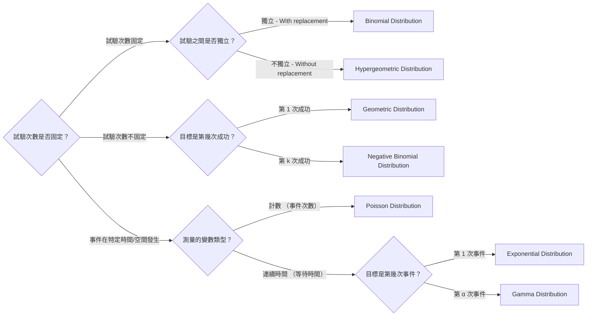

# Mid-Term Revision

## Ch.1 Fundamental Concepts

### Set Operations

|Law|Notations|
| ------------------| -----------|
|Commutative laws|$A \cup B = B \cup A$|
|Associative laws|$(A \cup B) \cup C = A \cup (B \cup C)$|
|**Distributive laws**|$A \cap (B\cup C) = (A \cap B) \cup (A \cap C)$|
|**De Morgan's laws**|$(A \cup B)' = A' \cap B'$|

### Probabilities

1. If $A_1, A_2, A_3, ...$ are mutually exclusive,   
   ​$P(A_1 \cup A_2 \cup ...) = P(A_1) + P(A_2) + ...$
2. **Inclusion Exclusion Formula :**

   1. $P(A \cup B) = P(A) + P(B) - P(A \cap B)$
   2. $P(A \cup B \cup C) = P(A) + P(B) + P(C) - P(A \cap B) - P(B\cap C) - P(A\cap C) + P(A\cap B \cap C)$

||**Order**|Without **Order**|
| :-| :---| :---------|
|**Without Replacement**|$P^n_r = \frac{n!}{(n-r)!}$|$C^n_r = \binom{n}{r} = \frac{n!}{r!(n-r)!}$|
|**With Replacement**|$n^r$|**Combination with Repetition** $C^{n+r-1}_r = \binom{n+r-1}{r}$|

#### Conditional Probability

1. $P(B|A) = \frac{P(B\cap A)}{P(A)}$
2. If $B$ and $C$ is mutually exclusive,  
   ​$P(B \cup C|A) = P(B|A) + P(C|A)$
3. $P(B'|A) = 1 - P(B|A)$
4. $P(A\cap B) = P(B|A) P(A) = P(A|B) P(B)$

#### Law of Total Probability

$$
\begin{align*}
P(B) 
&= P(B\cap A) + P(B \cap A') \\
&= P(B|A)P(A) + P(B|A')P(A')
\end{align*}
$$

#### Bayes' Theorem

$$
P(B_k|A) = \frac{P(A|B_k) P(B_k)}{P(A)}
$$

#### Independent Events

1. A and B are independent $\iff P(A\cap B) = P(A)P(B)$
2. A, B, C are mutually independent if

   1. Pairwise independent

      $$
      \begin{aligned}
      P(A\cap B) &= P(A)P(B)\\
      P(A\cap C) &= P(A)P(C)\\
      P(B\cap C) &= P(B)P(C)\\
      \end{aligned}
      $$
   2. $P(A \cap B \cap C) = P(A)P(B)P(C)$

|Concepts|Independent|Mutually Exclusive|
| :---------| :------------| :-------------------|
|**$P(A \cap B)$**|$P(A)P(B)$|$0$|
|**$P(A \cup B)$**|$P(A) + P(B) - P(A)P(B)$|$P(A) + P(B)$|
|**$P(A \mid B)$**|$P(A)$|$0$ |

## Ch.2 Discrete Distributions

- $E\left[g(x)\right] = \sum_{x \in S_X} g(x)f(x)$  

  - $E(a+bX) = a+bE(X)$
- $Var(X) = E(X^2) - [E(X)]^2$  

  - $Var(a+bX)= b^2Var(X)$

|Distribution|PMF|MGF|Notations|Mean & Variance|Explanation|
| ------------------------------------| -----| -------------------------| ---------------------------------------------------------------------------------------| ------------------| --------------------------------------------------------------------------------------------|
|Binomial Distribution $X \sim B(n,p)$ |$C^n_x p^x (1-p)^{n-x}$|$[(1-p)+pe^t]^n$|$n$ : No. of trials $x$ : No. of success $p$ : Prob. of success|$\begin{aligned} E(X) &= np\\ Var(X) &= np(1-p) \end{aligned}$ |With replacement (independent event)|
|Hypergeometric Distribution $X \sim HG(N_1, N_2, n)$ |$\frac{C^{N_1}_x \times C^{N_2}_{n-x}}{C^N_n}$|-  (Too complicated) |$N_1$ : Choice 1 (Desired) $N_2$ : Choice 2 $x$ : No. of success $n$ : No. of trials|$\begin{aligned} E(X) &= n\left( \frac{N_1}{N} \right)\\ Var(X) &= n\left( \frac{N_1}{N} \right) \left( \frac{N_2}{N} \right) \left( \frac{N-n}{N-1} \right)  \end{aligned}$|Without replacement|
|Poisson Distribution $X \sim \text{Poisson}(\lambda)$  $B(n, p) \approx \text{Poisson}(\lambda = np)$ |$\frac{\lambda^x e^{-\lambda}}{x!}$|$e^{\lambda (e^t -1)}$|$\lambda$ : No. of occurrence in interval $t$ : Length of interval $x$ : Desired no. of occurrence|$\begin{aligned} E(X) &= \lambda\\ Var(X) &= \lambda \end{aligned}$|在一個固定的間隔內，某個事件發生次數的概率|
|Geometric Distribution $X \sim \text{Geom}(p)$ |$(1-p)^{x-1}p$|$\frac{pe^t}{1-(1-p)e^t}$|$p$ : Prob. of success $x$ : No. of trial required for success|$\begin{aligned} E(X) &= \frac{1}{p}\\ Var(X) &= \frac{1-p}{p^2} \end{aligned}$|計算獲得第一次成功所需的總試驗次數 (Memoryless Property : 過去的試驗結果不影響未來的試驗)|
|Negative Binomial Distribution $X \sim NB(r,p)$|$C^{x-1}_{r-1} p^r (1-p)^{x-r}$|$\left[  \frac{pe^t}{1-(1-p)e^t} \right]^r$|$r$ : No. of success $p$ : Prob. of success $x$ : No. of trials required|$\begin{aligned} E(X) &= \frac{r}{p}\\ Var(X) &= \frac{r(1-p)}{p^2} \end{aligned}$|計算獲得 $r$ 次成功所需的總試驗次數 $X$|

> **Note**
>
> There is another form of Hypergeometric Distribution
>
> $X \sim HG(N,K,n)$
>
> - $N$ : Total choices ($N_1 + N_2$)
> - $K$ : Number of desired choices  ($N_1$)
> - $n$ : No. of trials
>
> Hence,
>
> $$
> \begin{align*}
> X &\sim HG(\underbrace{K}_{N_1}, \underbrace{N-K}_{N_2}, n) \quad [\text{In the form of }X \sim HG(N_1, N_2, n)]
> \end{align*}
> $$

> **Trinomial Distribution**
>
> When experiment has 3 results (mutually exclusive), and perform $n$ times independent experiments repeatedly.
>
> $$
> f(X_1 = x_1, X_2= x_2) = \frac{n!}{x_1! x_2! (n-x_1-x_2)!}p^{x_1}_1 p^{x_2}_2 p^{n-x_1-x_2}_3
> $$

### MGF

$$
M(t) = E\left(e^{tX} \right)
$$

- $E(X) = M'(0)$
- $Var(X) = M''(0) - [E(X)]^2$
-  $r$​th moment : $E(X^r)$

## Ch.4 Continuous Distributions

### Continuous Random Variables

- $P(a \le X \le b) = \int_a^b f(x) dx$
- $\int_{-\infty} ^{\infty} f(x) dx = 1$
- $f(x) = F'(x)$

$$
\begin{align*}
E(X) &= \int^{\infty}_{-\infty} xf(x)dx \\
Var(X) &= E[(X-\mu)^2] = \int^\infty_{-\infty} (x-\mu)^2 f(x)dx\\
M(t) &= \int^{\infty}_{-\infty} e^{tx}f(x)dx\\

\end{align*}
$$

### Percentile

$\int^{\pi _p}_{-\infty} f(x) dx = p$

- Median = $\pi_{0.5}$
- Lower quartile / First quartile = $\pi_{0.25}$
- Upper quartile / Third quartile = $\pi_{0.75}$

|Distribution|PDF|CDF|MGF|Mean & Variance|
| ------------------------------| -----| -----| -----| ------------------|
|Uniform Distribution $X \sim U(a,b)$|$f(x) =  \frac{1}{b-a},	\quad  a\le x \le b$|$F(x) =  \begin{cases} \frac{x-a}{b-a} \quad	& a \le x \le b\\ 0 			& x <a \\ 1 			& x>b \end{cases}$|$M(t) 	=  \begin{cases} \frac{e^{tb} - e^{ta}}{t(b-a)} \quad &t \ne 0\\ 1 & t= 0 \end{cases}$|$\begin{aligned} E(X)	&= \frac{a+b}{2} \\ Var(X)	&= \frac{(b-a)^2}{12} \end{aligned}$|
|Exponential Distribution $X \sim \text{Exp}(\theta)$|$f(x) = \frac{1}{\theta} e^{-\frac{x}{\theta}}, \quad 0 \le x < \infty$|$F(x)  =  \begin{cases} 1- e^{-\frac{x}{\theta}} \text{ or } 1-e^{-\lambda x}\quad & 0 \le x < \infty \\ 0 			& -\infty < x < 0 \end{cases}$|$M(t)= \frac{1}{1-\theta t}, \quad t <\frac{1}{\theta}$|$\begin{aligned} E(X) &= \theta\\ Var(X) &= \theta^2 \end{aligned}$|
|Gamma Distribution $X \sim \text{Gamma}(\alpha, \theta)$|$f(x) = \frac{x^{\alpha-1}e^{-\frac{x}{\theta}}} 	{\theta^\alpha (\alpha -1)!}\ , \quad x \ge 0$|-|$M(t) = \frac{1}{(1-\theta t)^\alpha}, \quad t < \frac{1}{\theta}$|$\begin{aligned} E(X) &= \alpha \theta\\ Var(X) &= \alpha \theta^2 \end{aligned}$|
|Chi-squared Distribution $X \sim \chi^2(r)$|$f(x) = \frac{ 		x^{\frac{r}{2}-1} 		e^{-\frac{x}{2}} 	} 	{ 		\Gamma \left(\frac{r}{2} \right) 		2^\frac{r}{2} 	} , \quad x\ge 0$|-|$M(t) = \frac{1}{(1-2t)^\frac{r}{2}} \ , \quad t < \frac{1}{2}$|$\begin{aligned} E(X) &= r\\ Var(X) &= 2r \end{aligned}$|
|Normal Distribution $X \sim N(\mu, \sigma^2)$|$f(x) 	= \frac{ 	e^{-\frac{(x-\mu)^2}{2 \sigma ^2}}} 	{\sigma \sqrt{2 \pi}}  ,  	\quad -\infty < x < \infty$|-|$M(t) = e^{\mu t + \frac{\sigma^2 t^2}{2}}$|$\begin{aligned} E(X)	&= \mu\\ Var(X) 	&= \sigma^2 \end{aligned}$|

- Exponential Distribution

  - Exponential distribution has **memoryless property**
  - **Survival Function of Exponential Distribution:**  $S(t) = P(T > t) = e^{-\lambda t}$
- Gamma Distribution

  - Gamma Function

    $$
    \begin{align*}
    \Gamma (t) &= \int_0^\infty y^{t-1} e^{-y} dy , \quad t>0\\

    &= \begin{cases}
    1 \quad &t=1\\
    (t-1)! &t\in \mathbb Z^+
    \end{cases}
    \end{align*}
    $$
  - $\theta$ : Scale parameter

    $\alpha$ : Shape parameter

    $$
    \begin{align*}
    X &\sim \text{Gamma}(\alpha, \theta)\\
    cX &\sim \text{Gamma}(\alpha, c\theta)\\
    a+bX &\nsim \text{Gamma}(\alpha, a+b\theta), \quad a,b>0
    \end{align*}
    $$

    > 改變 $\theta$ 會改變分佈的平均值（Mean）和變異數（Variance），從而影響分佈的「寬度」或「分散程度」，但**不會改變分佈的基本形狀**（Shape）
    >
- **Chi-squared Distribution :**  Special case of Gamma distribution

  - $\alpha = \frac{r}{2}$
  - $\theta = 2$
- **Standard Normal Distribution :**  $Z = \frac{X - \mu}{\sigma} \sim N(0,1)$  

  - $E(X) = 0$
  - $Var(X) = 1$
  - $M(t) = e^{\frac{1}{2}t^2}$
  - **Relationship with** **$\chi^2(1)$**​  **:**  $Z^2  \sim \chi^2(1)$

‍

‍

## Ch.3 & 5 Bivariate Discrete & Continuous Distributions

||Discrete Random Variable|Continuous Random Variable|
| -------------------------------------------| --------------------------| ----------------------------|
|p.m.f. / p.d.f.|$\begin{aligned} \sum_x \sum_y f(x,y) &= 1\\ f(x, y) &= f_X(x) f_{Y\|X=x}(y\|x) \end{aligned}$|$\begin{aligned} \int_{-\infty}^\infty \int_{-\infty}^\infty f(x,y)dxdy &= 1\\ f(x, y) &= f_X(x) f_{Y\|X=x}(y\|x) \end{aligned}$|
|c.d.f.||$F(x,y) = \int_{-\infty}^y \int_{-\infty}^x f(u,v) du dv$|
|Marginal p.m.f. / p.d.f.|$f_X(x) = \sum_{y} f(x,y)  $|$f_X(x) = \int_{-\infty}^\infty f(x,y) dy$|
|$E(X)$|$ E(X) = \sum_x xf_X(x)$|$E(X) = \int_{-\infty}^\infty  x f_X(x)$|
|Conditional p.m.f. / p.d.f.|$\begin{aligned} f_{X\|Y=y}(x) &= \frac{f(x,y)}{f_Y(y)}\\ E[X\|Y=y] &= \sum_x xf_{X\|Y=y}(x)\\ Var[X\|Y=y] &= E[X^2\|Y=y] - \{E[X\|Y=y]\}^2 \end{aligned}$|$\begin{aligned} f_{X\|Y=y} (x) &= \frac{f(x,y)}{f_Y(y)} \\ E(X\|Y=y) &= \int_{-\infty}^\infty xf_{X\|Y=y} (x) dx \\ Var(X\|Y=y) &= E(X^2\|Y=y) - [E(X\|Y=y)]^2 \end{aligned}$|
|Law of Iterated Expectations and Variance|$\begin{aligned} E(X) &= E[E(X\|Y)]\\ Var(X) &= Var[E(X\|Y)] + E[Var(X\|Y)] \end{aligned}$|Same|
|Covariance|$Cov(X,Y) =E(XY) - E(X)E(Y)$|Same|
|Correla​tion|$Corr(X,Y) = \rho = \frac{Cov(X,Y)}{\sqrt{Var(X)Var(Y)}}$|Same|

### Independence

- $X$ and $Y$ are independent $\iff f(x,y) = f_X(x)f_Y(y)$  

  - $P(X|Y=y) = f_X(x)$
  - $E(XY) = E(X)E(Y)$
  - $M_{X+Y}(t) = M_X(t)M_Y(t)$

> **Method to check independence**
>
> 1. **Check the support :**  $S_X \times S_Y \ne S_{X,Y} \to$ Not independent
> 2. $f(x,y) = f_X(x)f_Y(y)$

### Expectation

- $E(X+Y) = E(X) + E(Y)$

### Covariance

- $Var(X) = Cov(X,X)$
- $Cov(aX+b,cY+d) = acCov(X,Y)$
- $Cov(X+Y,Z) = Cov(X,Z) + Cov(Y,Z)$
- $Cov(X,Y) = 0$ if $X$ and $Y$ are independent / uncorrelated

  > - $Cov(X,Y) = 0 \nRightarrow$ Independent
  >
  > - $Cov(X,Y) = 0 \Rightarrow$ Uncorrelated
  >
  >  (Uncorrelated $\ne$ Independent)
  >
- $Var(X \pm Y) = Var(X) + Var(Y) \pm 2Cov(X,Y)$

### Correlation

- $Corr(X,Y) = 0$ if $X$ and $Y$ are independent / uncorrelated (same as covariance)
- $Corr(aX+b, cY+d) = Corr(X,Y)$ if both of $a$ and $c$ are positive / negative
- $Corr(aX+b, cY+d) = -Corr(X,Y)$ if $a$ and $c$ are one positive and one negative

> - $\rho$ is close to 1, strong positive linear relationship
> - $\rho$ is close to -1, strong negative linear relationship

$$
\text{Independent} \implies \text{Uncorrelated} \iff \left[\text{Cov}(X, Y) = 0\right] \iff \left[\text{Corr}(X, Y) = 0\right]
$$

### Bivariate Normal Distribution

For $Z_1, Z_2 \sim N(0,1)$ define

$$
\begin{align*}
X &= \sigma _X Z_1 + \mu_X\\
Y &= \sigma _Y \left(\rho Z_1 + \sqrt{1 - \rho^2} Z_2 \right) + \mu_Y
\end{align*}
$$

$$
f(x,y) = \frac{1}{2\pi \sigma_X \sigma_Y \sqrt{1-\rho^2}} \times e^{-\frac{1}{2(1-\rho^2)} 
\left[ 
	\left( 
		\frac{x- \mu_X}{\sigma_X}
	\right) ^2
- 2\rho \\
	\left( \frac{x - \mu_X}{\sigma_X}
	\right)
	\left( \frac{y - \mu_Y}{\sigma_Y}
	\right)
+	\left( 
		\frac{y-\mu_Y}{\sigma_Y}
	\right)^2
\right]
}
$$

1. $X\sim N(\mu_X, \sigma^2_X)$ and $Y\sim N(\mu_Y, \sigma^2_Y)$
2. $X|Y = y\sim N[\mu_X + \rho \frac{\sigma_X}{\sigma_Y} (y-\mu_Y), \sigma^2_X (1-\rho^2)]$  
   ​$Y|X = x\sim N[\mu_Y + \rho \frac{\sigma_Y}{\sigma_X} (x-\mu_X), \sigma^2_Y (1-\rho^2)]$
3. $Corr(X,Y) = \rho$
4. If $\rho = 0$, $X$ and $Y$ are independent
5. $aX + bY \sim N(a\mu_X + b\mu_Y, a^2 \sigma^2_X + 2ab\rho \sigma_X \sigma_Y + b^2 \sigma^2_Y)$

## Ch.6 Transformation of Random Variables

### Function of One Random Variable

#### Discrete Cases

**1-to-1 case :**  $P[Y = u(X)] = P[X = v(Y)] = f_X[v(y)]$

> **Steps**
>
> 1. Find support
> 2. Find inverse function of $Y = u(X)$
> 3. Sub inverse function $X = v(Y)$ into $f_X(x)$
>
>> **2-to-1 case**
>>
>> 找到所有導致 $y = u(x)$ 的 $x$ 值，並加總
>>
>> 	e.g. $f_Y(y) = f_X(\sqrt{y}) +f_X(-\sqrt{y})$
>>

#### Continuous Cases

For $Y=u(X)$, if $u(X)$ is 1-to-1 case,

- **$u(X)$** **is monotonic increasing :**  $F_Y(y) = P(X \le v(y)) = F_X[v(y)]$
- **$u(X)$** **is monotonic decreasing :**  $F_Y(y) = P(X \ge v(y)) = 1-F_X[v(y)]$

> ##### Summary
>
> For 1-to-1 case, **Distribution Function Technique** is to find c.d.f. and **Change of Variable Formula** is to find p.d.f.
>
> **Distribution Function Technique**
>
> For 1-to-1 case, find the inverse function of $y=u(x)$, then sub the inverse function $x = v(y)$ into $F_X(x)$.
>
> 	e.g. For $y = e^x$, $F_X[\ln(y)]$  
>
> If the function is monotonic decreasing, $F_Y(y) = 1 - F_X[v(y)]$
>
> **Change of Variable Formula**
>
> For 1-to-1 case, find inverse function $v(y)$.
>
> $$
> f_Y(y) = f_X[v(y)]|v'(y)|
> $$
>
> For 2-to-1 case, 找到所有所有導致 $y = u(x)$ 的 $x$ 值，代入公式後加總
>
> 	e.g. For $y=x^2$, $x_1(y) = \sqrt{y}, x_2(y) = -\sqrt{y}$  
>
> $$
> f_Y(y) 
> = f_X[x_1(y)] \left|\frac{dx_1(y)}{dy} \right| + f_X[x_2(y)] \left|\frac{dx_2(y)}{dy} \right|
> $$

### Functions of Two Random Variables

#### Discrete Cases

1. Find inverse function of $(A,B) = [g_1(X,Y), g_2(X,Y)]$
2. Sub the inverse function $(X,Y) = [h_1(A,B), h_2(A,B)]$ into $f_{X,Y}[h_1(A,B), h_2(A,B)]$

#### Continuous Cases

1. Find inverse function $h_1, h_2$
2. Find Jacobian matrix

   $$
   J = 
   \begin{vmatrix}
   \frac{\partial h_1}{\partial a} 
   & \frac{\partial h_1}{\partial b} \\\\
   \frac{\partial h_2}{\partial a} 
   & \frac{\partial h_2}{\partial b} 
   \end{vmatrix}
   $$
3. $f_{A,B}(a,b) = f_{X,Y}[h_1(a,b), h_2(a,b)] \times |J|$

### Functions of Independent Random Variables

For independent random variable $X_1, X_2,...,X_n$ with mean $\mu_1, \mu_2,...,\mu_n$ and variance $\sigma^2_1, \sigma^2_2, ..., \sigma^2_n$,

- $f(x_1, ..., x_n) = \prod^n_{i=1}f_{X_i}(x_i)$
- $E[g_1(X_1),...,g_n(X_n) = \prod^n_{i=1} E[g_i(X_i)]$
- Let $Y = \sum^n_{i=1} a_i X_i$,

  - $E(Y) = \sum^n_{i=1} a_i \mu_i$
  - $\sigma^2_Y = \sum^n_{i=1}a_i^2 \sigma^2_i$
  - $M_Y(t) = \prod^n_{i=1} M_{X_i}(a_i t)$

> - If $X_1, ..., X_n$ are independent random variables following $\chi^2 (r_1), ..., \chi^2 (r_n)$ respectively,
>
>   - then $Y$$=$$X_1 + ... + X_n ∼ \chi^2 (r_1 + ... + r_n)$
> - If $X_1, ..., X_n$ are independent normal random variables with means $\mu_1, ..., \mu_n$ and variances $\sigma^2_1 , ..., \sigma^2_n$ respectively,
>
>   - then $Y = \sum_{i=1}^{n} c_i X_i \sim N\left(\sum_{i=1}^{n} \textcolor{blue}{c_i} \mu_i, \sum_{i=1}^{n} \textcolor{red}{c_i^2} \sigma_i^2\right)$
> - If $Z_1, \dots, Z_n$ are independent random variables following $N(0, 1)$, 
>
>   - then $Y = Z_1^2 + Z_2^2 + \dots + Z_n^2 \sim \chi^2(1) + \dots + \chi^2(1) \sim \chi^2(n)$

> If $X_1, ..., X_n$ are continuous independent random variables,
>
> $$
> \begin{align*}
> P[max(X_1, ...,X_n) \ge a] &= 1-  P(X_1\le a)P(X_2 \le a)...P(X_n \le a) \\
> P[min(X_1, ...,X_n) \le a] &= 1 - P(X_1\ge a) P(X_2 \ge a)...P(X_n \ge a)
> \end{align*}
> $$

### Sample Mean & Variance

$$
\begin{align*}
\bar{X} &= \frac{1}{n} \sum^n_{i=1}X_i\\
S^2 &= \frac{1}{n-1} \sum^n_{i=1} \left(X_i-\bar{X}\right)^2
\end{align*}
$$

- If $X_1, ..., X_n$ follow Normal Distribution

  - $\bar{X}$ and $S^2$ are independent
  - $\frac{(n-1)S^2}{\sigma^2} \sim \chi^2 (n-1)$

### Central Limit Theorem

$$
W=\frac{\bar{X} - \mu}{\frac{\sigma}{\sqrt{n}}} \sim N(0,1)
$$

#### Continuity Correction

For approximating discrete distribution by normal distribution

1. Change $> / <$ to $\ge / \le$
2. Lower value $-0.5$ and Upper value $+0.5$

‍
