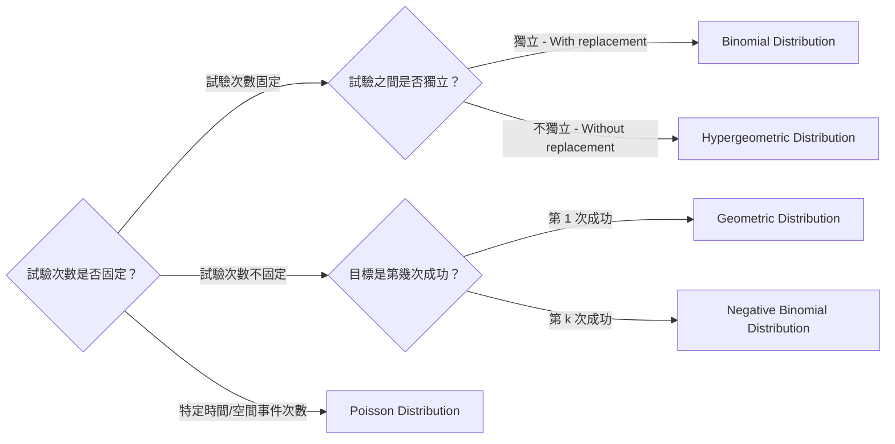

# Mid-Term Revision

## Ch.1 Fundamental Concepts

### Set Operations

|Law|Notations|
| ------------------| -----------|
|Commutative laws|$A \cup B = B \cup A$|
|Associative laws|$(A \cup B) \cup C = A \cup (B \cup C)$|
|**Distributive laws**|$A \cap (B\cup C) = (A \cap B) \cup (A \cap C)$|
|**De Morgan's laws**|$(A \cup B)' = A' \cap B'$|

### Probabilities

1. If $A_1, A_2, A_3, ...$ are mutually exclusive,   
    ​$P(A_1 \cup A_2 \cup ...) = P(A_1) + P(A_2) + ...$
2. **Inclusion Exclusion Formula :**

    1. $P(A \cup B) = P(A) + P(B) - P(A \cap B)$
    2. $P(A \cup B \cup C) = P(A) + P(B) + P(C) - P(A \cap B) - P(B\cap C) - P(A\cap C) + P(A\cap B \cap C)$

||**Order**|Without **Order**|
| :-| :---| :---------|
|**Without Replacement**|$P^n_r = \frac{n!}{(n-r)!}$|$C^n_r = \binom{n}{r} = \frac{n!}{r!(n-r)!}$|
|**With Replacement**|$n^r$|**Combination with Repetition** $C^{n+r-1}_r = \binom{n+r-1}{r}$|

#### Conditional Probability

1. $P(B|A) = \frac{P(B\cap A)}{P(A)}$
2. If $B$ and $C$ is mutually exclusive,  
    ​$P(B \cup C|A) = P(B|A) + P(C|A)$
3. $P(B'|A) = 1 - P(B|A)$
4. $P(A\cap B) = P(B|A) P(A) = P(A|B) P(B)$

#### Law of Total Probability

$$
\begin{align*}
P(B) 
&= P(B\cap A) + P(B \cap A') \\
&= P(B|A)P(A) + P(B|A')P(A')
\end{align*}
$$

#### Bayes' Theorem

$$
P(B_k|A) = \frac{P(A|B_k) P(B_k)}{P(A)}
$$

#### Independent Events

1. A and B are independent $\iff P(A\cap B) = P(A)P(B)$
2. A, B, C are mutually independent if

    1. Pairwise independent

        $$
        \begin{aligned}
        P(A\cap B) &= P(A)P(B)\\
        P(A\cap C) &= P(A)P(C)\\
        P(B\cap C) &= P(B)P(C)\\
        \end{aligned}
        $$
    2. $P(A \cap B \cap C) = P(A)P(B)P(C)$

|Concepts|Independent|Mutually Exclusive|
| :---------| :------------| :-------------------|
|**$P(A \cap B)$**|$P(A)P(B)$|$0$|
|**$P(A \cup B)$**|$P(A) + P(B) - P(A)P(B)$|$P(A) + P(B)$|
|**$P(A \mid B)$**|$P(A)$|$0$ |

## Ch.2 Discrete Distributions

- $E\left[g(x)\right] = \sum_{x \in S_X} g(x)f(x)$
- $Var(X) = E(X^2) - [E(X)]^2$

|Distribution|PMF|MGF|Notations|Mean & Variance|Explanation|
| ------------------------------------| -----| -------------------------| ---------------------------------------------------------------------------------------| ------------------| --------------------------------------------------------------------------------------------|
|Binomial Distribution $X \sim B(n,p)$ |$C^n_x p^x (1-p)^{n-x}$|$((1-p)+pe^t)^n$|$n$ : No. of trials $x$ : No. of success $p$ : Prob. of success|$\begin{aligned} E(X) &= np\\ Var(X) &= np(1-p) \end{aligned}$ |With replacement (independent event)|
|Hypergeometric Distribution $X \sim HG(N_1, N_2, n)$|$\frac{C^{N_1}_x \times C^{N_2}_{n-x}}{C^N_n}$|-  (Too complicated) |$N_1$ : Choice 1 (Desired) $N_2$ : Choice 2 $x$ : No. of success $n$ : No. of trials|$\begin{aligned} E(X) &= n\left( \frac{N_1}{N} \right)\\ Var(X) &= n\left( \frac{N_1}{N} \right) \left( \frac{N_2}{N} \right) \left( \frac{N-n}{N-1} \right)  \end{aligned}$|Without replacement|
|Poisson Distribution $X \sim \text{Poisson}(\lambda)$  $B(n, p) \approx \text{Poisson}(\lambda = np)$ |$\frac{\lambda^x e^{-\lambda}}{x!}$|$e^{\lambda (e^t -1)}$|$\lambda$ : No. of occurrence in interval $t$ : Length of interval $x$ : Desired no. of occurrence|$\begin{aligned} E(X) &= \lambda\\ Var(X) &= \lambda \end{aligned}$|在一個固定的間隔內，某個事件發生次數的概率|
|Geometric Distribution $X \sim \text{Geom}(p)$ |$(1-p)^{x-1}p$|$\frac{pe^t}{1-(1-p)e^t}$|$p$ : Prob. of success $x$ : No. of trial required for success|$\begin{aligned} E(X) &= \frac{1}{p}\\ Var(X) &= \frac{1-p}{p^2} \end{aligned}$|計算獲得第一次成功所需的總試驗次數 (Memoryless Property : 過去的試驗結果不影響未來的試驗)|
|Negative Binomial Distribution $X \sim NB(r,p)$|$C^{x-1}_{r-1} p^r (1-p)^{x-r}$|$\left(  \frac{pe^t}{1-(1-p)e^t} \right)^r$|$r$ : No. of success $p$ : Prob. of success $x$ : No. of trials required|$\begin{aligned} E(X) &= \frac{r}{p}\\ Var(X) &= \frac{r(1-p)}{p^2} \end{aligned}$|計算獲得 $r$ 次成功所需的總試驗次數 $X$|

‍

> **Trinomial Distribution**
>
> When experiment has 3 results (mutually exclusive), and perform $n$ times independent experiments repeatedly.
>
> $$
> f(X_1 = x_1, X_2= x_2) = \frac{n!}{x_1! x_2! (n-x_1-x_2)!}p^{x_1}_1 p^{x_2}_2 p^{n-x_1-x_2}_3
> $$

### MGF

$$
M(t) = E\left(e^{tX} \right)
$$

- $E(X) = M'(0)$
- $Var(X) = M''(0) - [E(X)]^2$

## Ch.3 Bivariate Discrete Distributions

### Marginal p.m.f.

$$
\begin{align*}
f_X(x) &= \sum_{\text{all possible $y$}} f(x,y) \\
E(X) &= \sum_{\text{all possible $x$}} x f_X(x)
\end{align*}
$$

### **Conditional p.m.f.**

$$
\begin{align*}
f_{X|Y=y}(x) &= \frac{f(x,y)}{f_Y(y)}\\
E[X|Y=y] &= \sum_\text{all possible $x$} xf_{X|Y=y}(x)\\
Var[X|Y=y] &= E[X^2|Y=y] - \{E[X|Y=y]\}^2
\end{align*}
$$

### Law of Iterated Expectations and Law of Total Variance

- $E(X) = E[E(X|Y)]$
- $Var[X] = Var[E(X|Y)] + E[Var(X|Y)]$

### Independence

- $X$ and $Y$ are independent $\iff f(x,y) = f_X(x)f_Y(y)$  

  - $P(X|Y=y) = f_X(x)$
  - $E(XY) = E(X)E(Y)$
  - $M_{X+Y}(t) = M_X(t)M_Y(t)$

> **Method to check independence**
>
> 1. **Check the support :**  $S_X \times S_Y \ne S_{X,Y} \to$ Not independent
> 2. $f(x,y) = f_X(x)f_Y(y)$

### Expectation

$$
E[g(X,Y)] = \sum_\text{All possible $x$}\sum_\text{All possible $y$} g(x,y)f(x,y)\\
$$

- $E(X+Y) = E(X) + E(Y)$

### Covariance

$$
Cov(X,Y) =E(XY) - E(X)E(Y)
$$

- $Var(X) = Cov(X,X)$
- $Cov(aX+b,cY+d) = acCov(X,Y)$
- $Cov(X+Y,Z) = Cov(X,Z) + Cov(Y,Z)$
- $Cov(X,Y) = 0$ if $X$ and $Y$ are independent

  > If $Cov(X,Y) = 0$, $X$ and $Y$ are uncorrelated (Uncorrelated $\ne$ Independent)
  >
- $Var(X \pm Y) = Var(X) + Var(Y) \pm 2Cov(X,Y)$

### Correlation

$$
Corr(X,Y) = \rho = \frac{Cov(X,Y)}{\sqrt{Var(X)Var(Y)}}
$$

- $Corr(X,Y) = 0$ if $X$ and $Y$ are independent
- $Corr(aX+b, cY+d) = Corr(X,Y)$ if both of $a$ and $c$ are positive / negative
- $Corr(aX+b, cY+d) = -Corr(X,Y)$ if $a$ and $c$ are one positive and one negative

> - $\rho$ is close to 1, strong positive linear relationship
> - $\rho$ is close to -1, strong negative linear relationship

‍
