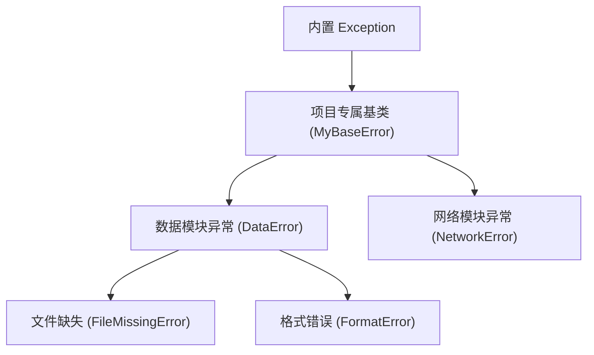
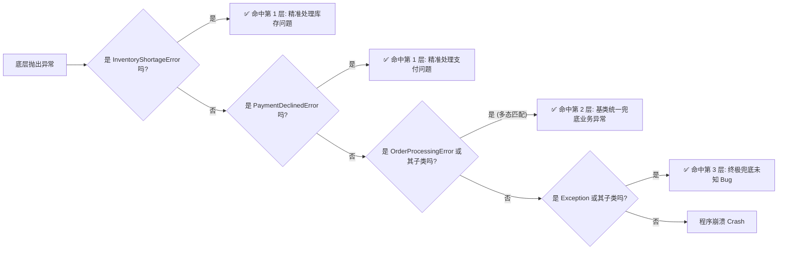

> 本文探讨了Python自定义异常的工程实践，通过业务场景对比说明其优势，详细介绍了异常层级设计原则、基于`raise ... from ...`的异常链追踪保留技术，以及利用继承实现的多态捕获与分层拦截策略，并给出了具体子类前置、避免兜底掩盖错误等核心最佳实践。

<!-- more -->


## 动机
内置异常（如 `ValueError`, `KeyError`, `FileNotFoundError`）只是描述技术层面的异常
而自定义异常可以用来描述业务层面的异常
例如：
- **原生异常**：`KeyError: 'courses'` （技术描述：字典里没这个键）
- **自定义异常**：`CourseDataFormatError: 课程数据缺少必要的 'courses' 字段` （业务描述：数据格式不符合业务规范）
自定义异常可以方便定位到是哪个模块出现问题
## 异常层级设计 (Exception Hierarchy)

**设计原则**：基类用于**统一兜底**，子类用于**精准区分**。
## 异常转换与追踪保留 (Exception Chaining)
出现异常时我们一方面要转换为自定义异常，另外一方面本身的异常信息也不应该丢失，因此我们要使用 `raise ... from ...` 语法 （见 异常处理 - raise ... from ... 语法）
```python
def load_config(file_path: str):
    try:
        with open(file_path) as f:
            return json.load(f)
    except FileNotFoundError as e:
        # 转换为自定义异常，并保留原生异常 e 的追踪信息
        raise ConfigFileMissingError(f"配置文件不存在: {file_path}") from e
```
#### 多态捕获与分层拦截 (Polymorphic Catching)
多态捕获与分层拦截的核心在于利用异常类的**继承关系 (Inheritance)**。
在顶层代码中，先使用 `except` 精准捕获需要特殊处理的**子类异常**，最后使用**基类异常**进行统一兜底。这既保证了关键业务的精细化处理，又大幅减少了重复的 `try-except` 代码，完美契合了**开闭原则 (Open-Closed Principle)**。
```python
import random

# ==========================================
# 1. 异常定义层 (Exception Hierarchy)
# ==========================================

class OrderProcessingError(Exception):
    """订单处理相关错误的基类 (Base Class for Order Errors)"""
    pass

class PaymentDeclinedError(OrderProcessingError):
    """支付被拒异常 (需要引导用户更换支付方式)"""
    pass

class InventoryShortageError(OrderProcessingError):
    """库存不足异常 (需要告知用户并推荐替代品)"""
    def __init__(self, item_name: str, remaining_stock: int):
        self.item_name = item_name
        self.remaining_stock = remaining_stock
        super().__init__(f"商品 '{item_name}' 库存不足。")

class ExternalAPIError(OrderProcessingError):
    """第三方接口调用异常 (如物流估算失败，属于非致命错误)"""
    pass


# ==========================================
# 2. 底层业务逻辑层 (Business Logic)
# ==========================================

def checkout_order(user_id: str, item_id: str, payment_method: str):
    """模拟复杂的订单结算流程"""
    print(f"[底层] 开始处理用户 {user_id} 的订单...")
    
    # 模拟校验库存 (随机抛出库存不足)
    if random.choice([True, False]):
        raise InventoryShortageError(item_name="机械键盘", remaining_stock=0)
        
    # 模拟支付扣款 (随机抛出支付失败)
    if payment_method == "credit_card" and random.choice([True, False]):
        raise PaymentDeclinedError("银行拒绝了该笔交易，余额不足或卡片被冻结。")
        
    # 模拟第三方物流接口超时 (随机抛出)
    if random.choice([True, False]):
        raise ExternalAPIError("物流运费估算接口超时。")

    print("[底层] 订单处理成功！")


# ==========================================
# 3. 顶层调用方 (UI / Controller Layer)
# ==========================================

def user_checkout_interface(user_id: str, item_id: str, pay_method: str):
    """顶层 UI 层：展示多态捕获与分层拦截的艺术"""
    print("-" * 50)
    try:
        # 调用底层业务逻辑
        checkout_order(user_id, item_id, pay_method)
        print("✅ 结账成功，感谢您的购买！")
        
    # ---------------------------------------------------------
    # 分层拦截开始 (Layered Catching)
    # ---------------------------------------------------------
    
    # 🎯 第一层：精准拦截特定的子类异常 (提供定制化 UI 交互)
    except InventoryShortageError as e:
        print(f"🛑 [UI 提示] 哎呀，{e.item_name} 卖光了！(当前库存: {e.remaining_stock})")
        print("💡 [UI 建议] 要不要看看同类型的其他商品？已为您加入心愿单。")
        
    except PaymentDeclinedError as e:
        print(f"💳 [UI 提示] 支付遇到问题：{e}")
        print("💡 [UI 建议] 请检查银行卡状态，或尝试使用微信/支付宝支付。")

    # 🛡️ 第二层：基类兜底拦截 (多态捕获 Polymorphic Catching)
    except OrderProcessingError as e:
        # ✅ 任何继承自 OrderProcessingError 的异常（如 ExternalAPIError）
        # 都会在这里被统一捕获，无需为每个细分错误单独写 except
        print(f"⚠️ [UI 提示] 订单处理遇到一些波折，但请不要担心。")
        print(f"📝 [后台日志] 记录非致命业务异常: {type(e).__name__} - {e}")
        print("💡 [UI 建议] 订单已进入排队重试队列，稍后会有短信通知您。")

    # 🚨 第三层：原生 Exception 终极兜底 (防范未知 Bug)
    except Exception as e:
        print(f"🐞 [严重错误] 系统发生未知崩溃: {type(e).__name__} - {e}")
        print("请联系客服并提供错误代码：#ERR-9527")


# ==========================================
# 运行测试
# ==========================================
if __name__ == "__main__":
    # 为了演示效果，我们多跑几次，看看不同的异常是如何被分层的
    for i in range(5):
        print(f"\n[测试轮次 {i+1}]")
        # 假设用户尝试用信用卡支付
        user_checkout_interface("User_001", "Item_Keyboard", "credit_card")
```
在代码中，`ExternalAPIError` 继承自 `OrderProcessingError`。
当底层抛出 `ExternalAPIError` 时，它**既是** `ExternalAPIError`，**也是** `OrderProcessingError`。 
因此，即使顶层只写了 `except OrderProcessingError:`，Python 也能成功捕获它。这就是面向对象中“向上转型 (Upcasting)”在异常处理中的体现。

## 工程最佳实践
1. 具体子类必须在基类之前 (Specific Before General)
```python
try:
    checkout()
except OrderProcessingError as e:  # ❌ 基类写在前面
    print("通用处理")
except PaymentDeclinedError as e:  # ❌ 永远无法执行到这里！
    print("精准处理")
```
**正确做法**：永远把最具体的子类异常放在最上面，基类异常放在最下面
2. 避免基类兜底掩盖致命错误
	1. 自定义异常基类应该**只继承自 `Exception`**（或更具体的内置异常如 `ValueError`），绝不要直接 `raise` 基类本身，基类只用于 `except` 捕获
