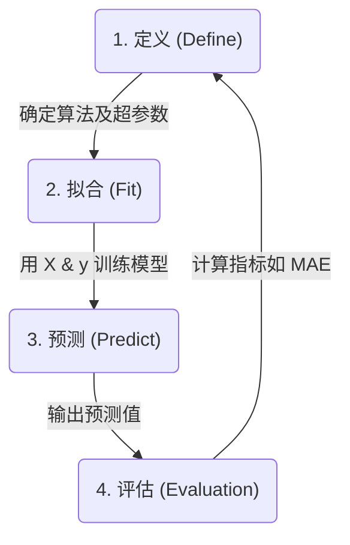

> Kaggle Intro to Machine Learning 课程笔记：从数据清洗与特征选取开始，用 sklearn 建立决策树模型，以 MAE 验证预测误差、区分训练集与验证集，最后比较过拟合／欠拟合，并引入更准确的随机森林算法。

<!-- more -->

> 这篇是我学习 Kaggle 的 [Intro to Machine Learning](https://www.kaggle.com/learn/intro-to-machine-learning) 课程，加上个人理解，综合所撰写的笔记
> 我会跳过一些我会的内容，例如 pandas 的基础操作

## 清洗数据和预处理 Data Cleaning & Preprocessing
做数据建模，我们首先要清洗一下数据，减少 noise data 来影响模型的质量，例如一些缺失值 missing value。最常用的方法就是用 pandas 的 `dropna` 功能来删掉缺失值。

之后清洗完数据后，就要找 prediction target （也就是预测值）和 特征 features，特征值在数据建模是非常重要的因素，选取好的特征值可以提高模型的准确度。

以 [Housing Prices Competition for Kaggle Learn Users](https://www.kaggle.com/competitions/home-data-for-ml-course/data) 为例，我们首先要了解我们的任务是啥——根据 Overview 所说，我们要预测房价，这就是我们的任务。

之后我们要阅读 [Data 选项卡](https://www.kaggle.com/competitions/home-data-for-ml-course/data) 中的 `data_description.txt` ，来了解每个 column 代表什么意思，以及它的值是什么类型，例如说是 int、float 或者是 str，之后就要来思考到底哪些 column 是跟房价有关。

```python
# ===数据准备===
# 下载数据
import kagglehub
path = kagglehub.competition_download('home-data-for-ml-course')

# 读取数据
import pandas as pd # 数据分析最常用的库
data = pd.read_csv(f"{path}/train.csv") # 读取训练集

# Set prediction target
y = data.SalePrice

# Set feature
features = ['LotArea', 
            'YearBuilt', 
            '1stFlrSF', # First Floor square feet
            '2ndFlrSF', 
            'FullBath', 
            'BedroomAbvGr'
           ]
X = data[features] # 把特征集中的数据保存在 X，在数据建模中只会用到 X 和 Y
print(X.head()) # 看一下效果
```

1. kagglehub 需要先安装，安装命令是 `pip install kagglehub`
2. 使用 KaggleHub 下载数据需要 API key 鉴权，可以在 https://www.kaggle.com/settings/api 申请

我是在 Kaggle Notebook 上运行代码，因此不需要 API key 鉴权，因此如果不熟悉相关操作，可以先在 Kaggle 的 Notebook 上使用


我这次就用了以上 columns 作为 feature 来提高模型的预测的准确度



## 数据建模
在机器学习中，一个最常用的 Python 库是 `sklearn`，它包含了大部分机器学习所需要的功能，例如一会要用的决策树（`DecisionTreeRegressor`）
在实践中，建模和使用模型的步骤如下：
1. **定义：** 使用哪种算法，是决策树或者是其他
2. **Fit:** 捕捉模型所需要的 features，这一个步骤是整个建模的核心
3. **Predict:** 预测数据
4. **Evaluation:** 评估模型的质量
```python
# ===数据建模===
from sklearn.tree import DecisionTreeRegressor
model = DecisionTreeRegressor(random_state=1) # 定义模型使用决策树

model.fit(X, y) # Fit
prediction = model.predict(X)

print(y) # 验证一下预测效果
print(f"\n预测的 Sales Price: {prediction}")
```
其中，`random_state` 是控制算法的随机种子：$\text{random\_state} \in \\{x \in \mathbb{Z} \mid 0 \le x \le 2^{32} - 1\\}$（可见[文档](https://scikit-learn.org/stable/glossary.html#term-random_state)）
固定 `random_state` 可以保证每次运行代码，产生的随机结果（也就是模型本身）是一致的。

## 模型验证
验证模型好坏，首先就是测量它预测的误差，一个最简单测量误差的方式就是 Mean Absolute Error (MAE)，也就是 $\text{Error} = | \text{Actual} - \text{Prediction} |$，而 Kaggle 比较常见的测量误差方式是 Mean Squared Error （MSE），不过这并不是课程的重点，暂时按下不表。
```python
# ===计算误差===
from sklearn.metrics import mean_absolute_error
print(mean_absolute_error(y, prediction)) # 计算真实数据和模型预测之间的误差
# 输出：73.31324200913242 
```
这个误差值并没有绝对的标准来评价高或低，需要跟不同模型来比较

另外，这个模型的训练集和测试集都是一样的，因此模型预测的准确度可以很高，但这并不代表使用其他数据集可以获得如此之好的效果。这就好像你在考试之前提前看了试卷，自然在那次考试可以高分，但这并不代表你在其他考试可以取得高分。
当模型遇到新数据，模型的准确度可能会下降，因此实务中，我们会把训练和测试的数据分开，用来测试模型预测准确度的数据被称为 validation data
```python
# ===分割数据集===
from sklearn.model_selection import train_test_split
train_X, val_X, train_y, val_y = train_test_split(X, y, random_state = 0)
# 分割为训练集和验证集

model = DecisionTreeRegressor()
model.fit(train_X, train_y) # 用训练集的数据建模

#===验证模型表现===
val_prediction = model.predict(val_X) # 用验证集的数据预测，来评估模型准确度
print(mean_absolute_error(val_y, val_prediction))
# 输出：30486.153424657536
```
显而易见，当模型遇到新数据（validation data），误差就明显增加了很多
## 过拟合和欠拟合
如果模型在训练集中表现优异，但在验证集表现很差，这种现象被称为过拟合。
而如果模型在训练集和验证集都表现很差，这种属于欠拟合。
借用[菜鸟教程](https://www.runoob.com/ml/ml-overfitting-underfitting-bias-and-variance.html)中的形象比喻：
> 在机器学习的世界里，构建一个模型就像训练一位学生，我们的目标是希望这位学生不仅能记住课本上的例题（训练数据），更能深刻理解背后的原理，从而在全新的、从未见过的考题（测试数据）上也能取得好成绩。然而，这位学生在学习过程中可能会遇到两种典型问题：
> - 一种是学得太死板，只会生搬硬套例题（**欠拟合**）；
> - 另一种是学得太聪明，把例题的标点符号甚至笔迹特点都背下来了，导致面对新题时不知所措（**过拟合**）。

在决策树中，过拟合是指有太多层级（或称为叶节点过多），而欠拟合则指决策树的层级太少（叶节点太少）。
我们可以用代码来比较一下过拟合和欠拟合的效果。
```python
def get_mae(max_leaf_nodes, train_X, val_X, train_y, val_y):
    model = DecisionTreeRegressor(max_leaf_nodes=max_leaf_nodes, random_state=0)
    model.fit(train_X, train_y)
    val_prediction = model.predict(val_X)
    mae = mean_absolute_error(val_y, val_prediction)
    return(mae) # 把模型建模和计算 MAE 打包成一个函数

for max_leaf_nodes in [5, 50, 500, 5000]: # 通过限制最多叶节点，来限制决策树的最多层级
    my_mae = get_mae(max_leaf_nodes, train_X, val_X, train_y, val_y)
    print("Max leaf nodes: %d  \t\t Mean Absolute Error:  %d" %(max_leaf_nodes, my_mae))
    
"""
输出：
Max leaf nodes: 5  		 Mean Absolute Error:  35190
Max leaf nodes: 50  		 Mean Absolute Error:  26860
Max leaf nodes: 500  		 Mean Absolute Error:  29718
Max leaf nodes: 5000  		 Mean Absolute Error:  29859
"""
```
MAE 的值在 50 叶节点 leaf nodes 的情况下是最小的，之后随着叶节点数量的上升而误差增加。

## 随机森林 Random Forests
随机森林是由多棵决策树组成，在构建每一棵决策树时会引入随机性，使得每棵树都不同（[菜鸟教程](https://www.runoob.com/ml/ml-random-forest.html)）。
随机森林通过取多棵树预测值的平均来进行预测，因此它比单个决策树的准确性要高。
```python
from sklearn.ensemble import RandomForestRegressor

forest_model = RandomForestRegressor(random_state=1)
forest_model.fit(train_X, train_y)
val_prediction = forest_model.predict(val_X)
print(mean_absolute_error(val_y, val_prediction))

# 输出：22583.184782798937
```
用随机森林建模的模型，明显比刚刚用单颗决策树的预测准确度（MAE = 26860）来的好（取  max_leaf nodes 为 50 的 MAE）。因此，随机森林是一个很好用的机器模型算法。


## 总结


[^1]: 根据官网文档所写，详情可见：